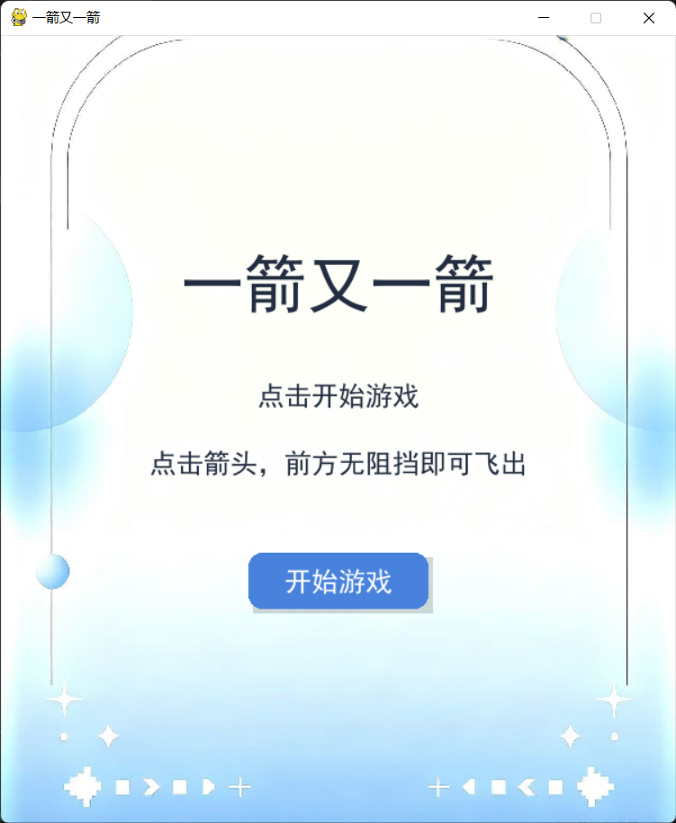
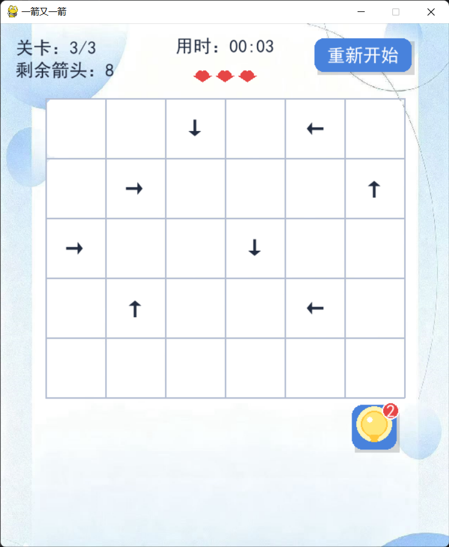

# 一箭又一箭 - Python Pygame 小游戏
> 课程作业项目，参考微信小游戏《一箭又一箭》核心玩法，独立实现，不使用原游戏素材与代码。

## 📖 游戏介绍
本项目使用 Python + Pygame 实现益智小游戏。
棋盘上存在若干带方向的箭头（上、下、左、右）。
- 点击箭头：若前进方向无障碍物，箭头飞出棋盘并消除；
- 若前方有其他箭头阻挡：箭头向前移动，碰到障碍物后返回原位，箭头变红做提示；
- **同一关卡内同一个被阻挡箭头，只会消耗1次失误机会，重复点击不再扣次数**；
- 失误次数耗尽 → 本关失败，可重新挑战；
- 清除本关全部箭头 → 通关，可选择【下一关】或【返回主页】。

## ✨ 功能特性
1. 多关卡系统，通关后跳转选择页面
2. 阻挡箭头缓动动画，碰撞后回弹
3. 失误红心UI（网格上方居中展示，最多3次失误）
4. 计时器 MM:SS 格式，仅精确到秒
5. 主页、游戏中、关卡通关、全部通关、关卡失败 多状态界面
6. 游戏内重新开始按钮
7. 提示功能：每关最多提示两次

## 📦 环境依赖
Python >=3.10
pygame == 2.6.1

安装依赖：
```
bash
pip install pygame
```

## 🚀 运行方法

1. 克隆仓库到本地

```
git clone https://github.com/你的用户名/arrow-shoot-game.git
cd arrow-shoot-game
```

2. 运行主程序

```
python main.py
```

## 🎮 操作说明

- 鼠标左键点击棋盘上的箭头进行操作
- 点击【重新开始】按钮重置当前关卡
- 通关弹窗：选择「下一关」继续挑战 /「返回主页」回到开始界面
- 失败弹窗：点击「重新开始」重试本关

## 📁 项目文件结构

```
arrow-shoot-game/
├── main.py          # 游戏主代码
└── README.md        # 项目说明文档
└──requirements      # 运行条件
└──.gitignore        # 忽略内容
```

## 📝 开发说明

- 图形库：Pygame
- 开发目的：课程编程作业
- 核心玩法参考《一箭又一箭》，所有代码、UI 绘制均为独立编写，无盗用原游戏资源

## 📄 License

本项目仅用于课程学习，禁止商用。

### 游戏截图

